# Rare Food

As an avid cook, I regularly visit the various different websites that proivide mountains of recipes. I always find that navigating around these sites and the general layout of their pages isn't the most pleasing on the eye. Due to this fact, I thought it would be an enjoyable task to try to recreate some of these recipe websites in a more aesthetically pleasing fashion.

BBC Good Food is one of my most visited recipe websites so I took inspiration from this and put my own spin on it. Also, I enjoy reading articles on the website Medium. I really love the zen style they use in displaying their content and decided to apply a zen style to my recipe website.

This website will be useful to anyone who loves cooking and finding new recipes, but hates the ugly and unappealing layout of some of the most popular recipe websites out there! The use of a zen style will be easy on the eye and enjoyable to use and navigate through.

My site is designed around the principals of [Material Design](https://material.io/design). 

### Index page 
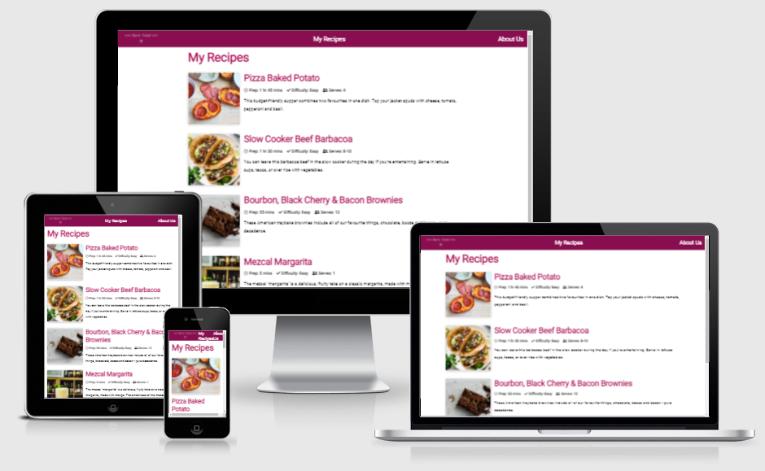 

### Recipe Page
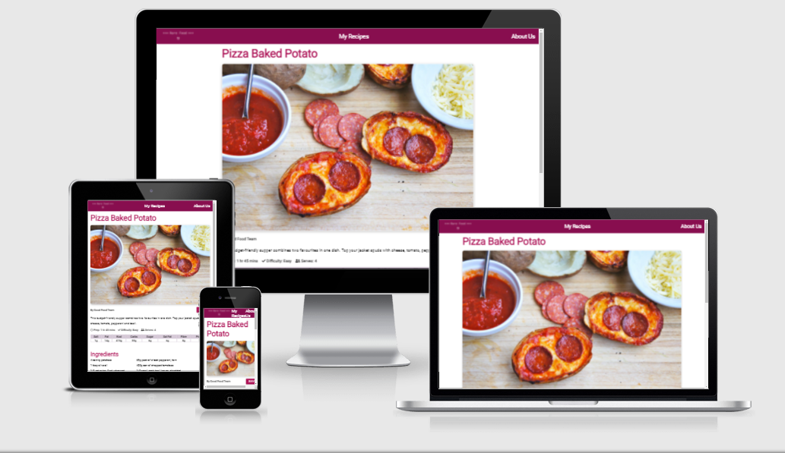

### About Page
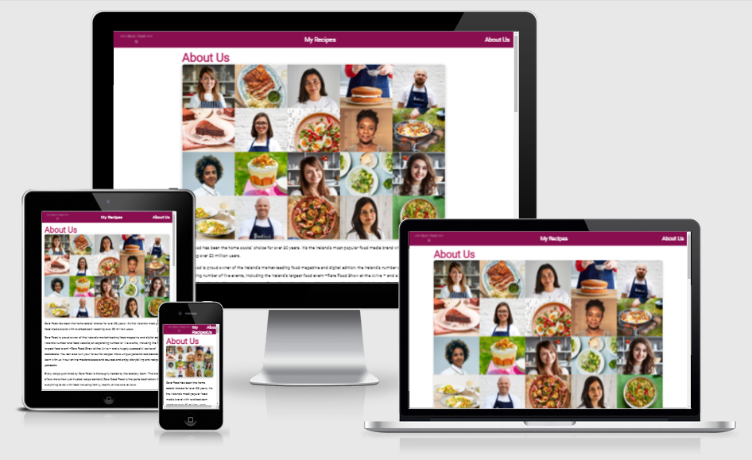

## Planning

- __Figma__

    - Before I took on the task of designing this website, I decided that I wanted to learn how to use [Figma](https://www.figma.com/). I know this will be a skill that will stand to me in the future and be a great aid in planning out projects I take on.
    - Here is a link to my figma file for this project [Figma](https://www.figma.com/file/EKrdJ3QGnBwFuPnZDfH4LV/rare-food?node-id=0%3A1)

## Features

Here I will highlight the main features I have included in my recipe website.

### Existing Features

- __Navigation Bar__
    
    

    - Featured on all three pages, the full responsive navigation bar includes a Logo, About page and a My Recipes page. It is identical in each page to allow for easy navigation.
    - This section will allow the user to easily navigate from page to page across all devices without having to revert back to the previous page via the ‘back’ button. 

- __The landing Page__

    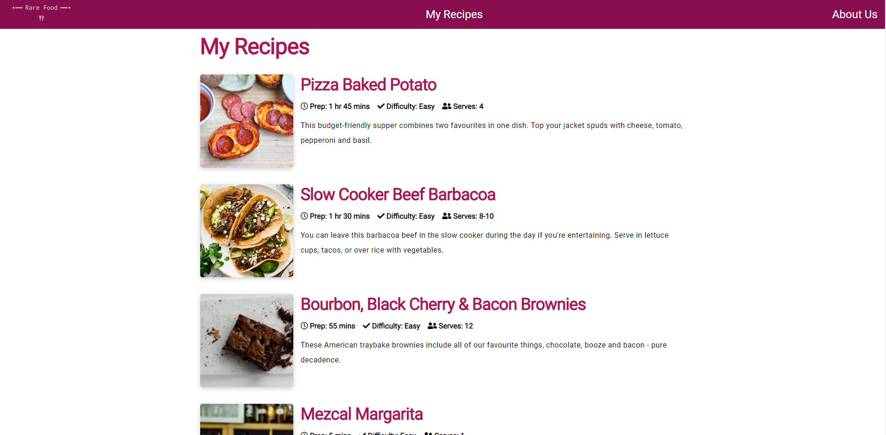

    - The landing page of this website is the 'My Recipes' page. This is a page where users will be able to browse the various recipes that the site has to offer.
    - With the use of cards, the recipes are aranged in a column down the page, providing a small amount of information about the particular recipe including the name of the dish, the time it takes to make, the difficulty, the amount of people it should serve and a short piece of text describing the dish.

- __The Nutrional Breakdown__
    
    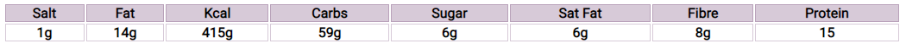

    - With a lot more people being into fitness and being generally healthy conscious, I feel it was important to have a section which higlighted the nutritional breakdown of each of the dishes. 
    - To do this, I created a table which displays this information in a clean and simple fashion making it easy for the user to gather the information they require.

- __The Ingredients Section__
    
    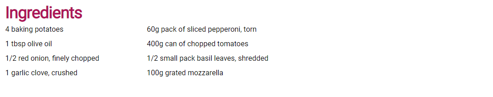

    - One of the things I find myself looking for when I visit a recipe page first is the ingredients section. Most people will check this to see how easily accessible the required ingredients are. To help with this, I have created a clean and simple list that displays the ingredients required to make each particular meal.

    - There is nothing else in this section other than the required ingredients. Some recipe sites can surround their ingredients section with useless information and unnessasary styling. I have taken all of this out of the equation and provided the ingredients in a 'zen' manner.

- __The Method Section__
    
    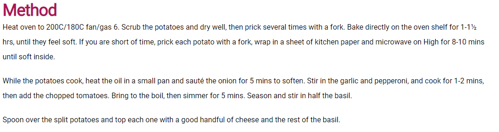

    - The same principals I discussed in the ingredients section apply to the method section
    - Laying everything out in a clean and simple manner is always my preferred wway of viewing things and the method section is no different from the ingredients section.

- __Recipe Cards__
    
    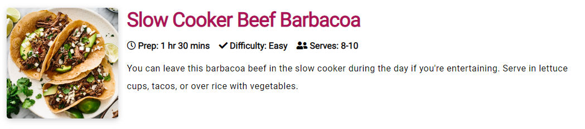

    - Taking inspiration from the browse page of [Medium](https://medium.com/), I wanted to display my recipes in cards. This is the ideal way to present the various recipes and provide just enough information to allow the user to decide whether they want to check out a particular recipe. I designed them around the fundamentals for cards from [Material Design Cards](https://material.io/components/cards)

- __About Page__
    
    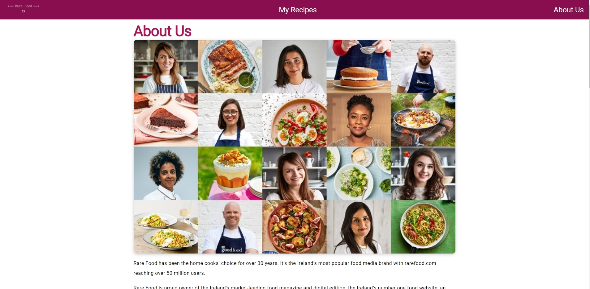

    - The About Page includes a large picture of people and food. It also includes information about each of the fabricated team member that work for Rare Food.

- __Footer__
    
    

    - The footer section includes links to the relevant social media sites for Rare Food. The links will open to a new tab to allow easy navigation for the user. It also includes a link to my GitHub profile.
    - The footer is valuable to the user as it encourages them to keep connected via social media.


### Features Left To Implement

- __Account System__

    - In order to implement some features I've considered for the future, I would need to add an account system and username and password validation. This would include a profile page that will show their saved recipes. To do this I would need to use a database.

- __Functioning Save Button__
    
    

    - I have included a save button feature on my recipe pages for styling purposes. The button is fully responsive but doesn't actual function. In the future, with the use of some JavaScript and JSON, I would love to add in a database system which will allow the user to save their favourite recipes to their verified profile page.

- __Recipe Posting Function__

    - If an account system is implemented, this could allow for users to post their own recipes in a form and share them with the rest of the websites community.

## Testing

- HTML
  - No errors were returned when passing through the official [W3C validator](https://validator.w3.org/)
  
  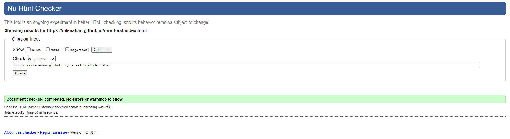

  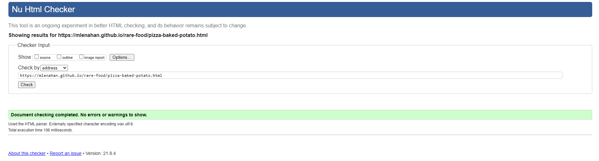

- CSS
  - No errors were found when passing through the official [(Jigsaw) validator](https://jigsaw.w3.org/css-validator/)
  (include screenshots)
  - I decided to use variable sin my CSS and I am aware that this validator doesn't recognise CSS variables but I am 100% sure that they work as intended.
  (include screenshots)

- Responsiveness
    - I have tested the responsiveness of my website on multiple browsers and devices. For desktop and laptop, I tested the webiste on Chrome and Safari. (include screenshots)

    - I have tested the responsiveness on iPhone and iPad also. (include screenshots)

    - There are no know issues with responsiveness across all devices and browsers I have tested.

### Unfixed Bugs

- I have encountered no bugs with my website so far, but will document them here if they occur in the future.

### Fixed Bugs

- I had an issue with my footer not sticking to the bottom of the page. In order to fix this I researched the issue. The resolution to this issue was to use ```bottom: 0;```.

## Deployment

- The site was deployed to GitHub pages. The steps to deploy are as follows: 
  - In the GitHub repository, navigate to the Settings tab 
  - From the source section drop-down menu, select the Master Branch
  - Once the master branch has been selected, the page will be automatically refreshed with a detailed ribbon display to indicate the successful deployment.

  The live link can be found here - https://mlenahan.github.io/rare-food/index.html

- To avoid potential plagiarism of my code, If someone wishes to clone the repo, they can do so by using this command in their terminal/command line ```git clone https://github.com/mlenahan/rare-food.git```
- If the user is using GitPod, they can clone the code using the GitPod button that would appear above the code.

### Credits

- The content of my recipes was taken from [BBC Good Food](https://www.bbcgoodfood.com/)
- The inspiration for my design and layout was taken from [Medium](https://medium.com/)
- I learned how to use and implement CSS variables through tutorials created by [Kevin Powell](https://www.youtube.com/kepowob)
- I learned how to use Figma through tutorials created by [Figma](https://www.youtube.com/channel/UCQsVmhSa4X-G3lHlUtejzLA)

### Media

    (include exact links for images used)
    (logo used)
